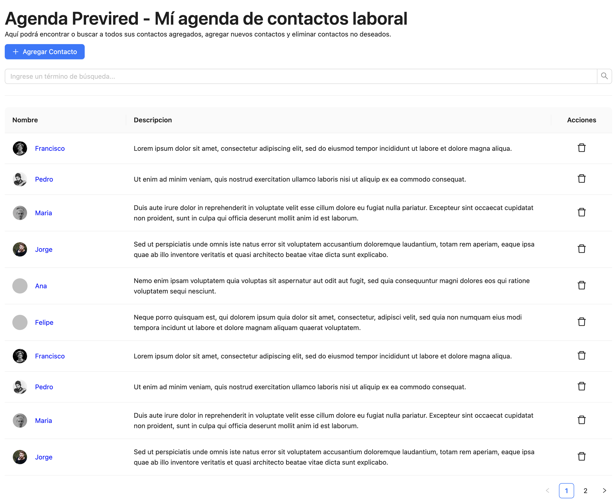

# Agenda Previred

## Mí agenda de contactos laboral

Agenda Previred es un App Web que permite gestionar los contactos personales
en una agenda



## Caracteristicas

- Listado de contactos
- Agregar contacto

## Tecnología

Agenda Previred esta construido en React con TypeScript, utilizando las siguientes tecnologías:

- [ViteJS] - Una herramienta de próxima generación para iniciar proyectos de React, ofreciendo un arranque rápido y optimizaciones de rendimiento.
- [Ant Design] - Una biblioteca de componentes de UI para React que facilita la creación de interfaces atractivas y coherentes.
- [axios] - Un cliente HTTP basado en promesas que simplifica las llamadas a APIs y la gestión de respuestas.
- [React Router] - Facilita el enrutamiento del lado del cliente, permitiendo la navegación entre diferentes vistas sin recargar la página.
- [React Query] - Mejora la gestión de estados asíncronos, optimizando las interacciones con APIs.

## Installation

Instalar dependencias y ejecutar en modo de desarrollo

```sh
npm install
npm run dev
```

## License

MIT

[//]: # "These are reference links used in the body of this note and get stripped out when the markdown processor does its job. There is no need to format nicely because it shouldn't be seen. Thanks SO - http://stackoverflow.com/questions/4823468/store-comments-in-markdown-syntax"
[ViteJS]: https://vitejs.dev/
[Ant Design]: https://ant.design/
[axios]: https://axios-http.com/
[React Router]: https://reactrouter.com/
[React Query]: https://tanstack.com/query/latest
[node.js]: http://nodejs.org
